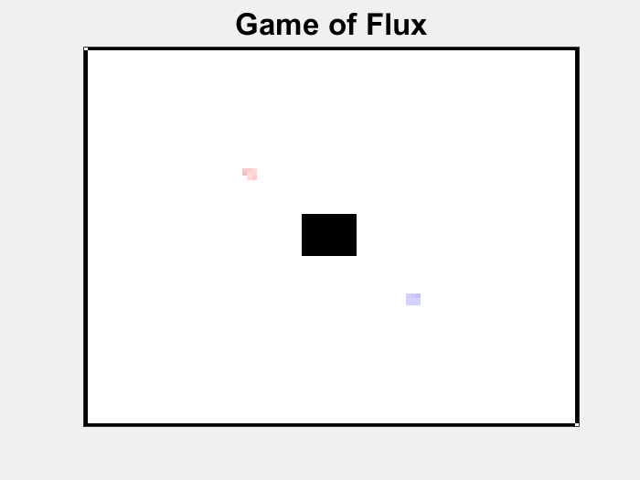

# Flux
Matlab game of energy flux battle between critters

The goal is to create a critter function that distributes the energy from itself to its close neighborhood to capture empty site and defeat the enemies.

## Vocabulary
   - Critter: 	Player function that distributes the energy
   - Site:		Unit of area
   - Farming: 	Gain of energy each round
   - Fight:		Moving energy to enemy site

## Rules
   - Every site that belongs to any critters farm 2 energy units each round
   - Mimimum energy to keep a site is 10. If below than the site becomes not free.
   - Maximum energy of a site is 990
   - Occupation of free sites is cost free
   - Fight:
       - Is caused by moving energy to site occupied by enemy
	   - Site is won by whoever has more energy
	   - Winner looses half of energy that looser had
   - Wall are static and cannot be breached
   - Critter see energy, type and state of neighboring surrounding sites
       - Exception: Critter doesn't see energy of enemy sites before the fight
   - Energy of site when any critter violated the rules becomes zero
   - Critter can set state of a site to whatever it wants
       - This can be used to transmit additional information
       - All neighboring states are visible including enemy sites

## Get started
   - Please have a look on example critter function (critter_random.m) that randomly distributing the energy to empty and enemy sites.
   - ** Run flux(@critter_random,@critter_random) to do your first fight **
   - Create your own critter function based on this example
   - If you believe you have a good one, make a pull request to this GIT repository so others to try to fight it